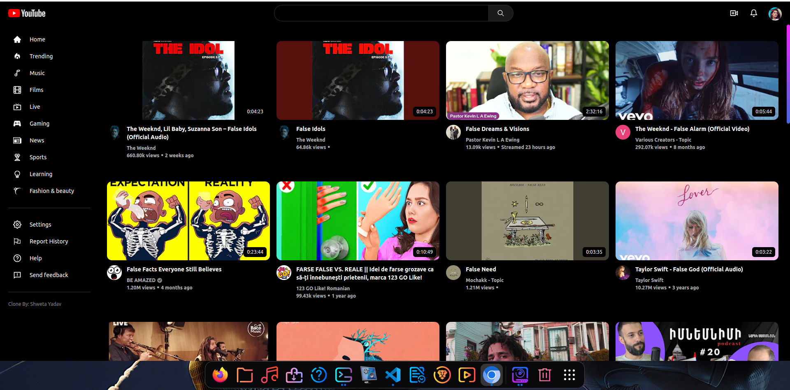

# Welcome to React Youtube Clone!

## A Youtube Clone

# Technologies 👇

## React 🔥

## Context Api 🔥

## React Router Dom 🔥

## Tailwind CSS🔥

## Youtube API (RapidAPI)

## Demo 🔥

<a href="https://s-youtube-clone.netlify.app/" target="_blank">Live Demo</a>

## Available Scripts 🔥

In the project directory, you can run:

### `Clone the repo`

### `npm install`

### `npm start`

